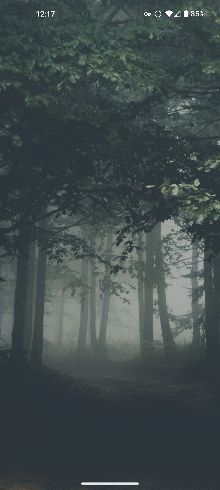

# phone



## Hardware

* Pixel 5a
* [Case](https://www.amazon.com/dp/B08X1R7873)

## GrapheneOS

https://grapheneos.org/install/cli

### Sideloading

<!-- https://grapheneos.org/usage#updates-sideloading -->

Disable automatic updates: https://grapheneos.org/usage#updates-disabling

Enter recovery mode:

1. Reboot
2. Hold down volume down
3. Select "Recovery Mode"
4. Press power button + volume up (power button first then followed by volume up)
5. Select "Apply update from ADB"

Download update zip:

https://grapheneos.org/releases

```
adb sideload barbet-ota_update-2024050700.zip
```

## Apps

### [F-Droid](https://f-droid.org/en/)

* Aegis
* Aurora Store
* Aves Libre
* Binary Eye
* Breezy Weather
* Clipboard Cleaner
* ConnectBot
* Discreet Launcher
* Element
* K-9 Mail
* OsmAnd~
* QKSMS
* VLC

### [Simple Mobile Tools](https://github.com/SimpleMobileTools)

* Simple Calculator
* Simple Calendar
* Simple File Manager
* Simple Gallery
* Simple Notes

### Aurora Store

* Amazon
* Brother Printer
* Canon Printer
* Chase
* Discord
* Dropbox
* Reddit
* SMS Backup & Restore
* Speedtest
* Stremio

### Misc

* [Wireguard](https://www.wireguard.com/)
* [Bromite](https://github.com/bromite/bromite/releases/tag/98.0.4758.108)
* [Signal](https://signal.org/android/apk/)
* [ReVanced](https://github.com/revanced/revanced-manager)
* [Spotify Lite](https://github.com/Team-xManager/xManager)

## Background

Allow background usage:

* Signal
* K-9 Mail

## Launcher

Import settings file:

```
discreetlauncher.txt
```

## LICENSE

MIT
